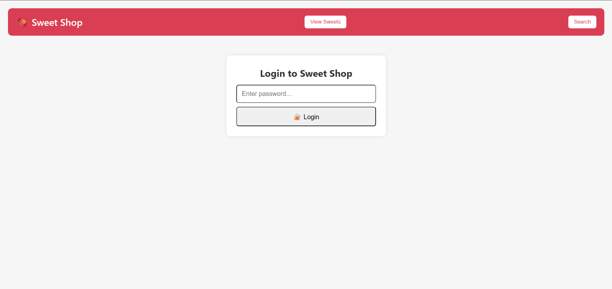
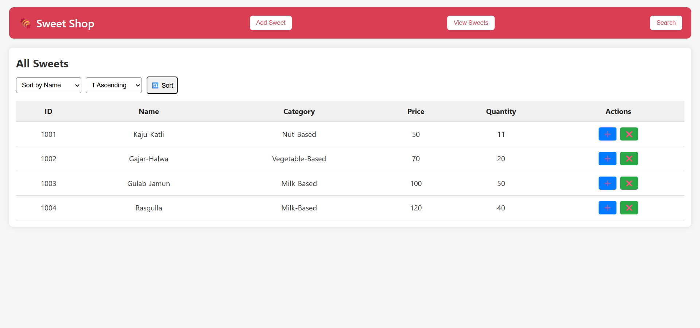
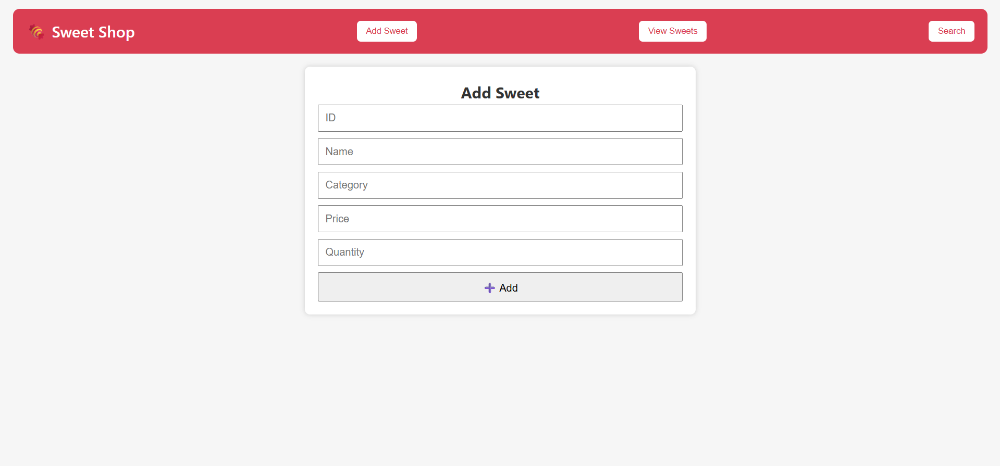
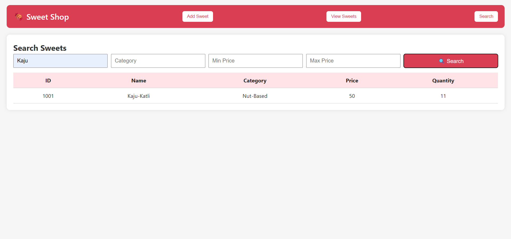

# 🍬 Sweet Shop Management System


A fully modular, test-driven sweet inventory management system with role-based access control. Built with HTML, CSS, JavaScript, Node.js, and Jest.

🔐 **Roles:**
- 🧑‍💼 Shop Owner → Add, Delete, Restock sweets
- 🧍 User → View, Search, Sort, Purchase sweets

---

## 📸 Screenshots

### 🔓 Login Page


### 📋 View Sweets and sort


### ➕ Add Sweet (Owner Only)


### 🔍 Search


---

## 🧪 Test Report

> Run using `npm test` or `npx jest`

```
Test Suites: 7 passed, 7 total
Tests:       42 passed, 42 total
Time:        2.166 s

 PASS  __tests__/purchaseSweet.test.js
  purchaseSweet()
    √ should reduce the quantity when sweet is purchased (10 ms)                                                                            
    √ should handle multiple purchases (1 ms)                                                                                               
    √ should throw error if sweet ID does not exist (17 ms)                                                                                 
    √ should throw error if purchase quantity exceeds stock (3 ms)                                                                          
    √ should throw error for zero or negative quantity (3 ms)                                                                               
                                                                                                                                            
 PASS  __tests__/addSweet.test.js                                                                                                           
  addSweet()                                                                                                                                
    √ should add a new sweet to the inventory (11 ms)                                                                                       
    √ should throw error if sweet with same ID already exists (19 ms)                                                                       
    √ should handle adding multiple valid sweets (1 ms)                                                                                     
    √ should throw error if input is not a Sweet instance (2 ms)                                                                            
    Sweet Constructor Validations                                                                                                           
      √ should throw error for invalid sweet details: id=null, name=Valid Name, category=Category, price=10, quantity=10 (3 ms)             
      √ should throw error for invalid sweet details: id=1, name=, category=Category, price=10, quantity=10 (1 ms)                          
      √ should throw error for invalid sweet details: id=2, name=Valid Name, category=Category, price=-10, quantity=5 (1 ms)                
      √ should throw error for invalid sweet details: id=3, name=Valid Name, category=Category, price=10, quantity=-5 (10 ms)               
                                                                                                                                            
 PASS  __tests__/restockSweet.test.js                                                                                                       
  restockSweet()
    √ should increase the quantity of an existing sweet (13 ms)                                                                             
    √ should handle multiple restocks correctly (1 ms)                                                                                      
    √ should throw error if sweet ID is not found (20 ms)                                                                                   
    √ should throw error if restock quantity is negative (2 ms)                                                                             
    √ should throw error if restock quantity is zero (3 ms)                                                                                 
                                                                                                                                            
 PASS  __tests__/searchSweet.test.js                                                                                                        
  searchSweet()                                                                                                                             
    √ should return sweets matching name (case insensitive) (10 ms)                                                                         
    √ should return empty array if no name matches (10 ms)                                                                                  
    √ should return sweets matching category (case insensitive) (3 ms)                                                                      
    √ should return empty array for invalid category (3 ms)                                                                                 
    √ should return sweets in the price range (7 ms)
    √ should return empty array if no sweet is in price range (1 ms)                                                                        
    √ should work with equal min and max price (1 ms)                                                                                       
    √ should throw error if min price is negative (34 ms)                                                                                   
    √ should throw error if max price is negative (2 ms)                                                                                    
    √ should throw error if min price > max price (1 ms)                                                                                    
                                                                                                                                            
 PASS  __tests__/getAllsweets.test.js                                                                                                       
  getAllSweets()                                                                                                                            
    √ should return all sweets added (20 ms)                                                                                                
    √ should return an empty array if no sweets exist (4 ms)                                                                                
    √ should return a new array (not reference to original) (1 ms)                                                                          
                                                                                                                                            
 PASS  __tests__/sortSweet.test.js                                                                                                          
  sortSweet()                                                                                                                               
    √ should sort sweets by name (A-Z) (72 ms)                                                                                              
    √ should sort sweets by category (A-Z) (1 ms)                                                                                           
    √ should sort sweets by price (ascending) (3 ms)                                                                                        
    √ should sort sweets by price in descending order (1 ms)                                                                                
    √ should throw error if sort order is invalid (28 ms)                                                                                   
    √ should return a new array, not reference (2 ms)                                                                                       
    √ should throw error on invalid sort key (2 ms)                                                                                         
                                                                                                                                            
 PASS  __tests__/deleteSweet.test.js                                                                                                        
  deleteSweet()
    √ should delete a sweet by ID (17 ms)                                                                                                   
    √ should not delete anything if wrong ID is given (12 ms)                                                                               
    √ should handle deleting multiple sweets one after another (1 ms)                                                                       
    √ should throw error if sweets array is empty (1 ms) 
```

📄 Includes edge case tests for:
- Duplicate sweets
- Invalid sweet details
- Negative/zero quantities
- Price range errors
- Invalid sort options

📊 To generate full coverage report:

```bash
npm test -- --coverage
```

Then open: `coverage/lcov-report/index.html`

---

## ✅ Features

| Feature              | User | Owner |
|----------------------|------|-------|
| View Sweets          | ✅   | ✅    |
| Add Sweet            | ❌   | ✅    |
| Delete Sweet         | ❌   | ✅    |
| Restock Sweet        | ❌   | ✅    |
| Purchase Sweet       | ✅   | ❌    |
| Search by name/category/price | ✅ | ✅ |
| Sort by name/category/price   | ✅ | ✅ |

---

## ⚙️ Setup Instructions

### 1️⃣ Clone Repository

```bash
git clone https://github.com/<your-username>/sweet-shop-management.git
cd sweet-shop-management
```

### 2️⃣ Install Dependencies

```bash
npm install
```

### 3️⃣ Start Backend

```bash
npm start
```

> Runs on: `http://localhost:3000`

### 4️⃣ Run Frontend

Open `frontend/index.html` using **Live Server in VS Code**  
Or serve it using any static file server

### 5️⃣ Run Tests (Jest)

To ensure all features work as expected and edge cases are covered:

```bash
npm test
```

---

## 🔐 Login Credentials

| Role   | Password   |
|--------|------------|
| User   | `user123`  |
| Owner  | `owner123` |

Role is set dynamically and controls frontend behavior.


## 💡 Technologies Used

- **Frontend**: HTML, CSS, Vanilla JS
- **Backend**: Node.js, Express
- **Testing**: Jest
